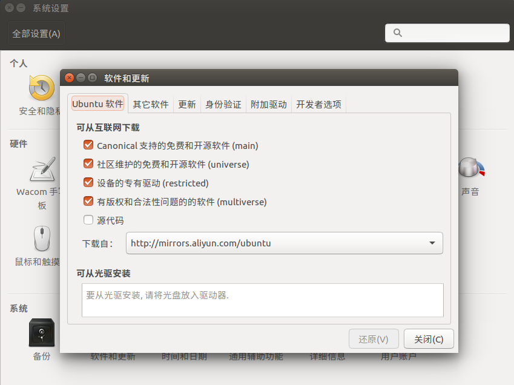
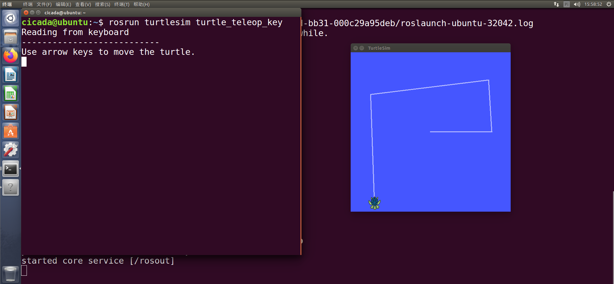

ROS安装过程
====
参考资料来源：[在Ubuntu中安装ROS Kinetic](http://wiki.ros.org/cn/kinetic/Installation/Ubuntu)
笔者所使用的Linux版本为ubuntu-16.04.7-desktop-amd64，本次安装的ROS版本为ROS Kinetic。

1. 配置Ubuntu软件仓库
----

打开Ubuntu图形化界面中的“系统设置->软件和更新”，确保上图中的“restricted”“universe”和“multiverse”三个选项均被勾选（在中国大陆的网络环境下安装ROS时建议将“下载自”中的源地址改为中国大陆境内服务器地址）。

2. 设置sources.list
----   
输入以下命令以确保可以安装来自packages.ros.org的软件。
```
   sudo sh -c 'echo "deb http://packages.ros.org/ros/ubuntu $(lsb_release -sc) main" > /etc/apt/sources.list.d/ros-latest.list'
```
处于中国大陆网络环境可以就近选择一个镜像源替换上面的命令。例如，Tsinghua University为：
```
   sudo sh -c '. /etc/lsb-release && echo "deb http://mirrors.tuna.tsinghua.edu.cn/ros/ubuntu/ `lsb_release -cs` main" > /etc/apt/sources.list.d/ros-latest.list'
```

3. 设置密钥
----
```
   sudo apt-key adv --keyserver 'hkp://keyserver.ubuntu.com:80' --recv-key C1CF6E31E6BADE8868B172B4F42ED6FBAB17C654
```

4. 安装
----
更新软件列表：
```
   sudo apt-get update
```
更新软件（非必要）：
```
   sudo apt-get upgrade
```
安装ROS：
```
   #桌面完整版(推荐): 包含ROS、rqt、rviz、机器人通用库、2D/3D 模拟器、导航以及2D/3D感知
   sudo apt-get install ros-kinetic-desktop-full

   #桌面版安装: 包含ROS、rqt、rviz以及通用机器人函数库。
   sudo apt-get install ros-kinetic-desktop

   #基础版安装(简版): 包含ROS核心软件包、构建工具以及通信相关的程序库，无GUI工具。
   sudo apt-get install ros-kinetic-ros-base
```

5. 初始化 rosdep
----
rosdep可以方便在你需要编译某些源码的时候为其安装一些系统依赖，同时也是某些ROS核心功能组件所必需用到的工具。安装命令：
```
   sudo rosdep init
   rosdep update
```
   &emsp;&emsp;中国大陆互联网环境下运行`rosdep update`命令可能会出现类似下面的错误：
```
   $ rosdep update
    reading in sources list data from /etc/ros/rosdep/sources.list.d
    ERROR: error loading sources list:
	('The read operation timed out')
```
   解决方案：修改如下几处代码：
   - 输入下面的命令，在打开的文件中找到`download_rosdep_data()`函数，
```
        $ sudo gedit /usr/lib/python2.7/dist-packages/rosdep2/sources_list.py
```
        在文件的310行和311行之间新增一行，输入下面的代码：
        ```
        url="https://ghproxy.com/"+url
        ```
        修改后的`download_rosdep_data()`函数为：
        ```python
        def download_rosdep_data(url):
            """
            :raises: :exc:`DownloadFailure` If data cannot be
                retrieved (e.g. 404, bad YAML format, server down).
            """
            try:
                # http/https URLs need custom requests to specify the user-agent, since some repositories reject
                # requests from the default user-agent.
	            url="https://ghproxy.com/"+url
                if url.startswith("http://") or url.startswith("https://"):
                    url_request = request.Request(url, headers={'User-Agent': 'rosdep/{version}'.format(version=__version__)})
                else:
                    url_request = url
                f = urlopen(url_request, timeout=DOWNLOAD_TIMEOUT)
                text = f.read()
                f.close()
                data = yaml.safe_load(text)
                if type(data) != dict:
                    raise DownloadFailure('rosdep data from [%s] is not a YAML dictionary' % (url))
                return data
            except (URLError, httplib.HTTPException) as e:
                raise DownloadFailure(str(e) + ' (%s)' % url)
            except yaml.YAMLError as e:
                raise DownloadFailure(str(e))
        ```
    - 修改/usr/lib/python2.7/dist-packages/rosdistro/\_\_init\_\_.py文件中的DEFAULT_INDEX_URL：
        ```
        $ sudo gedit /usr/lib/python2.7/dist-packages/rosdistro/__init__.py
        DEFAULT_INDEX_URL = 'https://ghproxy.com/https://raw.githubusercontent.com/ros/rosdistro/master/index-v4.yaml'
        ```
    - 修改其余（4个）文件中的地址，在地址 https://raw.githubusercontent.com/... 前添加https://ghproxy.com/
        ```
        $ sudo gedit /usr/lib/python2.7/dist-packages/rosdep2/gbpdistro_support.py
        //修改第36行的地址
        $ sudo gedit /usr/lib/python2.7/dist-packages/rosdep2/sources_list.py 72行
        //修改第72行
        $ sudo gedit /usr/lib/python2.7/dist-packages/rosdep2/rep3.py
        //修改第39行
        $ sudo gedit /usr/lib/python2.7/dist-packages/rosdistro/manifest_provider/github.py
        //修改第68行、119行
        ```
    - 解决 Hit 第五个地址的报错
        ```
        $ sudo gedit /usr/lib/python2.7/dist-packages/rosdep2/gbpdistro_support.py 
        //在第204行添加如下代码（即在该函数块下的第一行处）
        gbpdistro_url = "https://ghproxy.com/" + gbpdistro_url
        //注意，原网址中代理地址的双引号是中文，直接粘贴复制会报字符识别错误
        ```

6. 环境配置
----
   ```
   echo "source /opt/ros/kinetic/setup.bash" >> ~/.bashrc
   source ~/.bashrc
   ```

7. 构建工厂依赖
----
   ```
   sudo apt-get install python-rosinstall python-rosinstall-generator python-wstool build-essential
   ```
至此，ROS的安装基本完成，下面进行ROS的测试。

8. 测试
----
   - 启动主节点
    打开终端输入下面命令以启动ROS1的主节点（Master）。
```
        $ roscore
```
        ROS安装成功则会有如下输出：
```
        cicada@ubuntu:~$ roscore
        ... logging to /home/cicada/.ros/log/87edcabe-08c8-11ed-bb31-000c29a95deb/roslaunch-ubuntu-32042.log
        Checking log directory for disk usage. This may take awhile.
        Press Ctrl-C to interrupt
        Done checking log file disk usage. Usage is <1GB.
        started roslaunch server http://ubuntu:37847/
        ros_comm version 1.12.17


        SUMMARY
        ========

        PARAMETERS
        * /rosdistro: kinetic
        * /rosversion: 1.12.17

        NODES

        auto-starting new master
        process[master]: started with pid [32053]
        ROS_MASTER_URI=http://ubuntu:11311/

        setting /run_id to 87edcabe-08c8-11ed-bb31-000c29a95deb
        process[rosout-1]: started with pid [32066]
        started core service [/rosout]
```
   - 启动 turtlesim
     启动一个turtlesim节点并通过键盘控制其运动，新开启一个终端，执行以下命令：
```
        $ rosrun turtlesim turtlesim_node
```
然后，再开启一个终端：
```
        $ rosrun turtlesim turtle_teleop_key
```
        将光标停在此终端，即可通过方向键控制小海龟运动。
        

C++学习
====
主要参考了[蓝桥云课](https://www.lanqiao.cn/)（原实验楼）的[C++ 基础入门实战](https://www.lanqiao.cn/courses/2752/)课程。

Git 与 GitHub 学习
====
主要参考了[蓝桥云课](https://www.lanqiao.cn/)（原实验楼）的[Git 与 GitHub 入门实践](https://www.lanqiao.cn/courses/1035/)课程。
简单总结一下提交代码到GitHub的几条常用命令：
```
git add.
git commit -m "版本更新信息"
git push
```
以及其它常用的Git命令：


Markdown学习
====
主要参考了[菜鸟教程](https://www.runoob.com/)的[Markdown 教程](https://www.runoob.com/markdown/md-tutorial.html)。
本文档原文件即使用Markdown语言编写。

神经网络学习
====
主要参考书籍为[《Python神经网络编程》](https://book.douban.com/subject/30192800/)，PDF格式电子书资源及源码可参见<https://github.com/jash-git/Book-Python-Neural-Network>。
在Jupyter Notebook环境下使用Python语言构建简单的神经网络来识别手写数字，目前正在学习中。