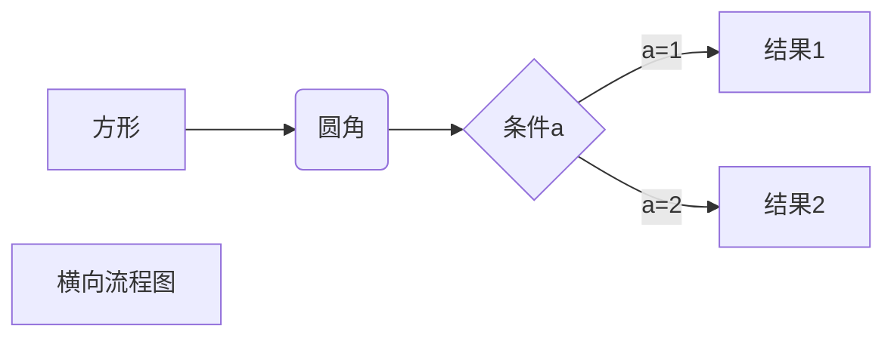
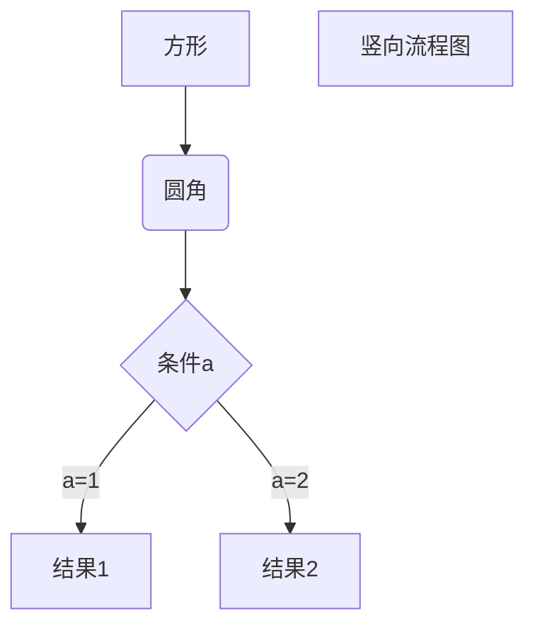
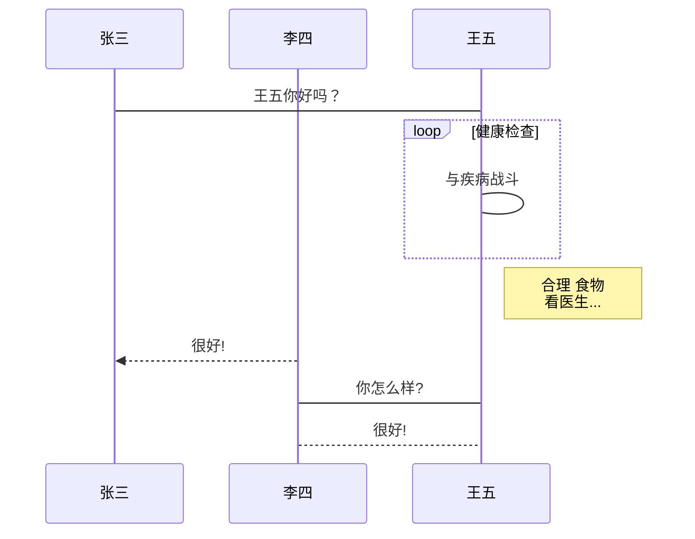
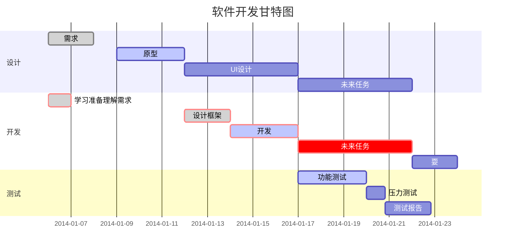

# 一级标题
## 二级标题
### 三级标题
#### 四级标题
##### 五级标题
###### 六级标题

同样是一级标题
=================

同样是二级标题
-----------------
小车正穿行在落基山脉蜿蜒曲折的盘山公路上。克利斯朵夫·李维静静地望着窗外，发现每当车子即将行驶到无路的关头，路边都会出现一块交通指示牌：“前方转弯！”或“注意！急转弯”。而每拐过一道弯之后，前方照例又是一片柳暗花明、豁然开朗。山路弯弯、峰回路转，“前方转弯”几个大字一次次地冲击着他的眼熟，也渐渐叩开了他的心扉：原来，不是路已到了尽头，而是该转弯了。路在脚下，更在心中，心随路转，心路常宽。学会转弯也是人生的智慧，因为挫折往往是转折，危机同时是转机。

*斜体文本*
分隔线：
***
_斜体文本_
* * *
**粗体文本**
*****
__粗体文本__
- - -
--------------------
***粗斜体文本***
___粗斜体文本___
~~删除线~~
<u>下划线</u>
脚注：cicada[^cicada]
[^cicada]:https://github.com/vicada
***
无序列表：
* 第一项
+ 第二项
- 第三项
  - 第四项
    - 第五项
- - -
有序列表：
1. 第一项
2. 第二项
3. 第三项
***
错误的有序列表：
1.第一项
2.第二项
3.第三项
***
区块：
> 湖北听力试音：
>> 小车正穿行在落基山脉蜿蜒曲折的盘山公路上。克利斯朵夫·李维静静地望着窗外，发现每当车子即将行驶到无路的关头，路边都会出现一块交通指示牌：“前方转弯！”或“注意！急转弯”。而每拐过一道弯之后，前方照例又是一片柳暗花明、豁然开朗。山路弯弯、峰回路转，“前方转弯”几个大字一次次地冲击着他的眼熟，也渐渐叩开了他的心扉：原来，不是路已到了尽头，而是该转弯了。路在脚下，更在心中，心随路转，心路常宽。学会转弯也是人生的智慧，因为挫折往往是转折，危机同时是转机。
***
`printf()`函数

    #include <iostream> //iostream 表示对流运行读写操作。
    using namespace std; //使用标准 C++ 库中的所有成员。

    int main()
    {
        cout << "Hello cpp!" << endl; 
        //cout 为标准输出流对象；
        //endl 表示插入换行符，并刷新流。
        return 0;
    }

```C
#include<stdio.h>
int main()
{
    printf("Hello, World.\n");
    return 0;
}
```
***
这是一个连接：[必应](https://cn.bing.com)
或者：<https://cn.bing.com>
这样呢：[www.baidu.com](https://cn.bing.com)
***

我的 [github][github_vicada]

[github_vicada]: https://github.com/vicada/

***


图片2：[p2][p2]

[p2]:./star2.png


***
# 表格
|表头|表头|
|----|----|
|单元格|单元格|
|单元格|单元格|

|左对齐齐齐齐齐齐|居中对齐齐齐齐齐齐|右对齐齐齐齐齐齐|
|:----|:----:|----:|
|单元格|单元格|单元格|
|单元格|单元格|单元格|
***
使用 <kbd>Ctrl</kbd>+<kbd>Alt</kbd>+<kbd>Del</kbd> 重启电脑
***
数学表达式：
$$
\begin{Bmatrix}
   a & b \\
   c & d
\end{Bmatrix}
$$
$$
\begin{CD}
   A @>a>> B \\
@VbVV @AAcA \\
   C @= D
\end{CD}
$$
***
1、横向流程图源码格式：

***
2、竖向流程图源码格式：

***
3、标准流程图源码格式：
```flow
st=>start: 开始框
op=>operation: 处理框
cond=>condition: 判断框(是或否?)
sub1=>subroutine: 子流程
io=>inputoutput: 输入输出框
e=>end: 结束框
st->op->cond
cond(yes)->io->e
cond(no)->sub1(right)->op
```
***
4、标准流程图源码格式（横向）：
```flow
st=>start: 开始框
op=>operation: 处理框
cond=>condition: 判断框(是或否?)
sub1=>subroutine: 子流程
io=>inputoutput: 输入输出框
e=>end: 结束框
st(right)->op(right)->cond
cond(yes)->io(bottom)->e
cond(no)->sub1(right)->op
```
***
5、UML时序图源码样例：
```sequence
对象A->对象B: 对象B你好吗?（请求）
Note right of 对象B: 对象B的描述
Note left of 对象A: 对象A的描述(提示)
对象B-->对象A: 我很好(响应)
对象A->对象B: 你真的好吗？
```
***
6、UML时序图源码复杂样例：
```sequence
Title: 标题：复杂使用
对象A->对象B: 对象B你好吗?（请求）
Note right of 对象B: 对象B的描述
Note left of 对象A: 对象A的描述(提示)
对象B-->对象A: 我很好(响应)
对象B->小三: 你好吗
小三-->>对象A: 对象B找我了
对象A->对象B: 你真的好吗？
Note over 小三,对象B: 我们是朋友
participant C
Note right of C: 没人陪我玩
```
***
7、UML标准时序图样例：

***
8、甘特图样例：
